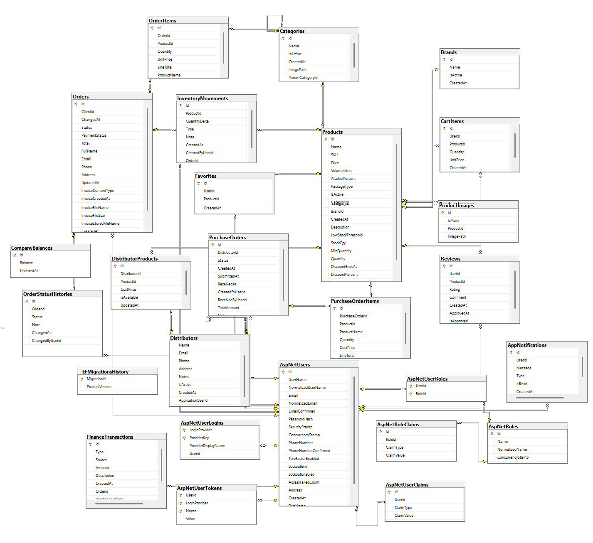

# Задание 2: Проектиране и архитектура на решението

## 1. Тип на приложението

Проектът **Bevera / Питиетата** представлява **уеб приложение**, разработено за управление на склад, продукти, поръчки и доставки на напитки. Приложението е реализирано чрез архитектурния модел **ASP.NET Core MVC**, който разделя логиката на приложението на модели, изгледи и контролери.

Системата позволява работа с различни типове потребители чрез роли:
- **Admin**
- **Worker**
- **Client**
- **Distributor**

Всеки тип потребител има различни права и достъп до различни части от системата.

---

## 2. Структура на проекта

Проектът е организиран в логична и ясна структура, която улеснява поддръжката и разширяването му.

### Основни папки:
- **Controllers** – съдържа контролерите, които обработват заявките и управляват логиката между моделите и изгледите.
- **Models** – съдържа основните класове/ентитита на системата.
- **Views** – съдържа визуалната част на приложението (Razor изгледи).
- **Data** – съдържа `ApplicationDbContext` и връзката с базата данни.
- **Services** – съдържа помощни услуги и бизнес логика.
- **Helpers** – помощни класове и константи.
- **Extensions** – разширения и допълнителни помощни методи.
- **wwwroot** – статични файлове като CSS, JavaScript, изображения.
- **Migrations** – миграции за базата данни.
- **ViewComponents** – компоненти за многократно използваеми части от интерфейса.
- **Areas** – използва се за логическо отделяне на части от приложението.

---

## 3. Основни модули / слоеве

Приложението е разделено на няколко основни модула:

### 3.1 Каталог
Свързан е с управлението и визуализирането на:
- категории
- подкатегории
- марки
- продукти
- продуктови изображения

### 3.2 Поръчки
Отговаря за:
- количка
- създаване на поръчки
- детайли за поръчките
- статуси на поръчките
- история на промените

### 3.3 Потребители и роли
Използва **ASP.NET Core Identity** за:
- регистрация
- вход
- управление на роли
- достъп до различни функционалности според потребителя

### 3.4 Склад
Следи:
- наличности на продуктите
- движения в склада
- намаляване и увеличаване на наличности

### 3.5 Доставки
Модулът за доставки включва:
- дистрибутори
- продукти на дистрибутор
- заявки към дистрибутори
- артикули в заявките

### 3.6 Финанси
Свързан е с:
- баланс на фирмата
- финансови транзакции
- приходи и разходи

### 3.7 Клиентски функционалности
Включва:
- разглеждане на продукти
- любими продукти
- ревюта
- известия
- профил

---

## 4. Основни класове / обекти / ентитита

### 4.1 Catalog
- **Category** – съхранява категории и подкатегории.
- **Brand** – съхранява марките на продуктите.
- **Product** – основен обект за продуктите в системата.
- **ProductImage** – изображения, свързани с даден продукт.

### 4.2 Поръчки
- **CartItem** – продукт в количката на потребителя.
- **Order** – основна информация за направена поръчка.
- **OrderItem** – отделен продукт в дадена поръчка.
- **OrderStatusHistory** – история на промените по статуса на поръчката.

### 4.3 Потребители
- **ApplicationUser** – разширен потребител на системата, базиран на Identity.
- **Favorite** – любими продукти на потребителя.
- **Review** – ревю и оценка за продукт.
- **AppNotification** – известия към потребителите.

### 4.4 Склад
- **InventoryMovement** – промяна в наличността на даден продукт.

### 4.5 Доставки
- **Distributor** – дистрибутор, който доставя продукти.
- **DistributorProduct** – връзка между дистрибутор и продукт.
- **PurchaseOrder** – заявка към дистрибутор.
- **PurchaseOrderItem** – отделен продукт в заявка към дистрибутор.

### 4.6 Финанси
- **CompanyBalance** – текущ баланс на фирмата.
- **FinanceTransaction** – финансова операция (приход или разход).

### 4.7 ViewModels
В проекта има и отделна папка **ViewModels**, която съдържа модели за визуализация и работа с формите, например:
- `AdminDashboardViewModel`
- `AdminProductFormViewModel`
- `CartItemVm`
- `CheckoutVm`
- `OrderDetailsViewModel`
- `WorkerDashboardVm`
- `PaginationViewModel`
- `PagedResult`

Тези класове не се записват директно в базата данни, а се използват за обмен на данни между контролерите и изгледите.

---

## 5. Таблици и връзки (база данни)

Проектът използва **релационна база данни**, управлявана чрез **Entity Framework Core**.

### Основни таблици:
- `Categories`
- `Brands`
- `Products`
- `ProductImages`
- `CartItems`
- `Orders`
- `OrderItems`
- `OrderStatusHistories`
- `InventoryMovements`
- `Favorites`
- `Reviews`
- `AppNotifications`
- `Distributors`
- `DistributorProducts`
- `PurchaseOrders`
- `PurchaseOrderItems`
- `CompanyBalances`
- `FinanceTransactions`
- Identity таблици: `AspNetUsers`, `AspNetRoles`, `AspNetUserRoles` и др.

### Основни връзки:
- Една **категория** може да има много **подкатегории**
- Една **категория** може да съдържа много **продукти**
- Една **марка** може да има много **продукти**
- Един **продукт** може да има много **изображения**
- Една **поръчка** може да има много **продукти в OrderItems**
- Един **потребител** може да има много **любими**, **ревюта** и **известия**
- Един **дистрибутор** може да предлага много **продукти**
- Една **заявка към дистрибутор** може да има много **артикули**
- Един **продукт** може да присъства в много записи за складови движения
- Финансовите транзакции се свързват с потребители, поръчки и заявки

### Примери за основни полета:
- **Product** – `Name`, `SKU`, `Price`, `CostPrice`, `StockQty`, `CategoryId`, `BrandId`
- **Category** – `Name`, `ParentCategoryId`
- **Order** – `ClientId`, `Status`, `PaymentStatus`, `Total`, `CreatedAt`
- **OrderItem** – `OrderId`, `ProductId`, `Quantity`, `UnitPrice`, `LineTotal`
- **DistributorProduct** – `DistributorId`, `ProductId`, `CostPrice`, `IsAvailable`
- **FinanceTransaction** – `Type`, `Source`, `Amount`, `Description`, `CreatedAt`

---

## 6. Диаграма / схема

Към проекта е добавена диаграма на базата данни, която показва основните таблици и връзките между тях.

Файл:
`docs/BeveraDiagramDB.png`

Примерен markdown линк:

Диаграмата представя:
- таблиците в системата
- връзките между потребители, продукти, поръчки, доставки и финанси
- структурата на релационната база данни

---

## 7. Потребителски поток

### 7.1 Клиент
Основният поток за клиент е:
1. Отваря началната страница
2. Разглежда категории и продукти
3. Отваря детайли за продукт
4. Добавя продукт в количка
5. Завършва поръчка
6. Проследява своите поръчки
7. Може да оставя ревюта и да добавя продукти в любими

### 7.2 Служител (Worker)
Основният поток за служител е:
1. Влиза в системата
2. Отваря работното табло
3. Вижда новите поръчки
4. Променя статуса им
5. Следи продукти с ниска наличност
6. Участва в обработката на заявките

### 7.3 Администратор
Основният поток за администратор е:
1. Влиза в административния панел
2. Управлява продукти, категории и промоции
3. Управлява роли и потребители
4. Управлява доставки и дистрибутори
5. Следи общите показатели на системата
6. Следи финансовите операции

### 7.4 Дистрибутор
Основният поток за дистрибутор е:
1. Влиза в системата
2. Вижда възложените му заявки
3. Подготвя заявките
4. Потвърждава/изпраща информация по доставката

### Основни екрани / страници:
- Начална страница
- Категории
- Детайли за продукт
- Количка
- Поръчки
- Админ панел
- Worker dashboard
- Distributor panel
- Известия
- Ревюта

---

## 8. Използвани технологии

В проекта са използвани следните технологии:

- **C#** – основен програмен език
- **ASP.NET Core MVC** – framework за уеб приложението
- **Entity Framework Core** – ORM за работа с базата данни
- **SQL Server** – релационна база данни
- **ASP.NET Core Identity** – управление на потребители и роли
- **Razor Views** – изгледи за потребителския интерфейс
- **Bootstrap** – изграждане на responsive дизайн
- **JavaScript** – клиентска логика и интерактивност
- **CSS** – стилизиране на потребителския интерфейс

---

## 9. Защо са избрани тези технологии

Избраните технологии са подходящи за разработката на подобен тип система, защото осигуряват добра структура, лесна поддръжка и възможност за разширяване.

- **C#** е подходящ език за разработка на бизнес приложения в .NET среда.
- **ASP.NET Core MVC** позволява ясно разделение между логика, данни и интерфейс.
- **Entity Framework Core** улеснява работата с базата данни чрез класове и миграции.
- **SQL Server** е надеждна релационна база данни и работи добре с .NET приложения.
- **Identity** улеснява управлението на потребители, роли и сигурност.
- **Bootstrap** помага за бързо изграждане на подреден и responsive интерфейс.
- **JavaScript** добавя динамика и по-добро потребителско изживяване.

---

## Заключение

Проектът е разработен като многомодулно уеб приложение с ясно разделение на отговорностите между отделните части. Архитектурата му позволява поддръжка, надграждане и добавяне на нови функционалности. Използваните технологии и структурата на решението го правят подходящ за реален практически сценарий, свързан с управление на склад, поръчки и доставки.
